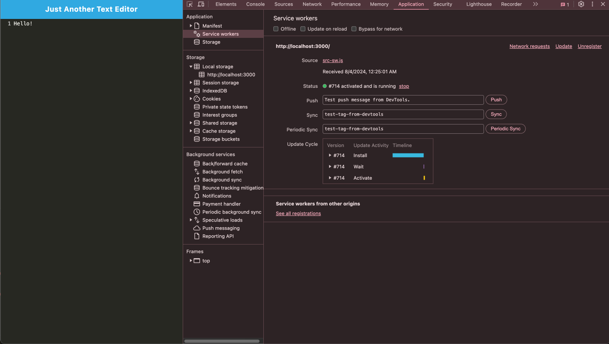
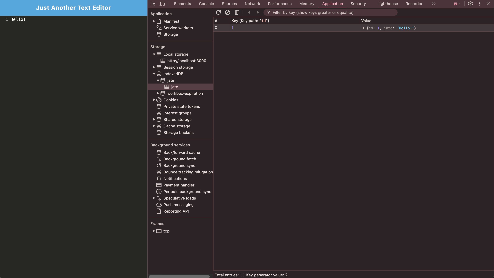
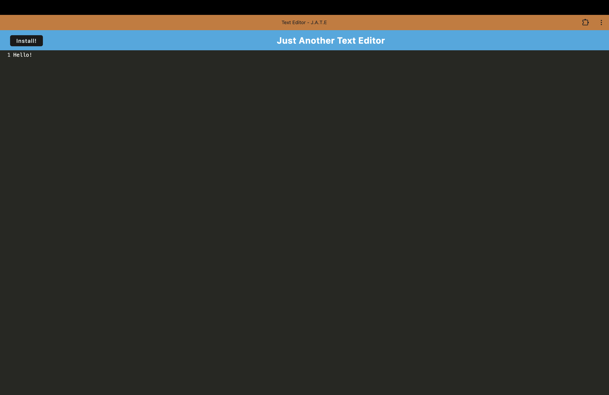

# Text Editor PWA

- [Description](#description)
- [Technologies Used](#technologies-used)
- [Features](#features)
- [Screenshots](#screenshots)
- [Installation](#installation)
- [Deployment](#deployment)
- [Development](#development)
- [Contributing](#contributing)
- [License](#license)
- [Questions](#questions)

## Description

Text Editor PWA is a Progressive Web Application that provides a versatile text editing experience. It allows users to create and manage text documents offline, leveraging modern web technologies for a native app-like experience. The application uses IndexedDB for storing content and is fully capable of functioning without an internet connection.

## Technologies Used

- **Frontend**: HTML, CSS, JavaScript
- **Build Tools**: Webpack for bundling JavaScript and CSS
- **Service Worker**: Workbox for caching and offline functionality
- **PWA**: Progressive Web App features including installation and offline access
- **IndexedDB**: For storing and retrieving text content

## Features

- **Offline Functionality**: Edit and save text documents offline using IndexedDB.
- **PWA Support**: Install the app on your desktop or mobile device.
- **Responsive Design**: Optimized for various screen sizes and devices.
- **Service Worker**: Automatically caches assets for offline access.

## Screenshots
The following animation demonstrates the application functionality:


The following image shows the application's `manifest.json` file:


The following image shows the application's registered service worker:


The following image shows the indexedDB:


The following image shows the app running natively:


## Installation

To set up the project locally:

1. **Clone the repository**:
   ```bash
   git clone https://github.com/Sei-cloud/Text-Editor--PWA.git
2. **Navigate to the project directory**:
    ```bash 
    cd text-editor-pwa
3. **Install dependencies**:
    ```bash
    npm install
4. **Build the app**:
    ```bash
    npm run build
5. **Start the server**:
    ```bash
    npm run start
6. The application will be available at http://localhost:3000.

## Development

1. Start the development server:
    ```bash
    npm run start
2. The server will automatically watch for changes and rebuild the application.

## Contributing

Contributions are welcome! If you have suggestions or improvements, please open an issue to [TEXT-EDITOR--PWA](https://github.com/Sei-cloud/Text-Editor--PWA/issues).

## License

This project is licensed under the [MIT License](https://opensource.org/licenses/MIT).

## Questions

For questions about the project, please feel free to contact [Sei-Cloud](https://github.com/Sei-Cloud) or [Email me](mailto:rocketsei.009@gmail.com).

## URL 
Deployed URL: https://text-editor-pwa-leff.onrender.com/

Github URL: https://github.com/Sei-cloud/Text-Editor--PWA